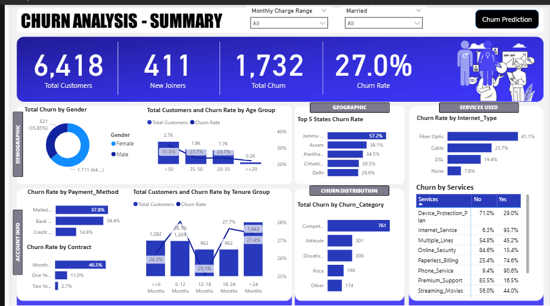
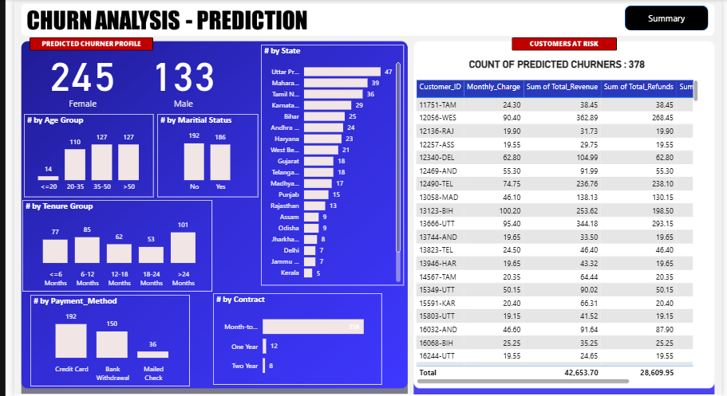

# Telecom Customer Churn: End-to-End Analytics & Prediction

An end-to-end data analytics and predictive modeling project designed to identify high-risk telecom customers and drive business retention strategies. This project combines the analytical depth of **SQL** and **Power BI** with the predictive power of **Machine Learning (Python)**.

---

## 📊 Phase 1: Dashboard Insights & Churn Drivers
The Power BI dashboard provides a detailed summary of **6,418 historical customers** with a baseline **Churn Rate of 27.0%**.

### 🔍 Dashboard Summary View

### Key Discoveries:
- **Contract Impact:** Month-to-Month contract holders represent the highest churn risk, suffering a massive **46.5% churn rate**.
- **Internet Type:** Customers utilizing **Fiber Optic** internet show a significant churn rate of **41.1%**, indicating potential price or service dissatisfaction.
- **Payment & Billing:** Customers using **Mailed Checks** churned at **37.8%**, showing that friction in payment methods correlates with a drop in customer loyalty.
- **Top Competitor Threat:** Competitive offers were highlighted as the #1 churn category driver.

---

## 🤖 Phase 2: Machine Learning Prediction
Using historical behaviors, a **Random Forest Classifier** was trained to identify high-risk customer profiles. 

### 🎯 Predictive Churner Profile View

### Key Outputs:
- **Feature Importance:** Features like `Contract type`, `Total Revenue`, and `Monthly Charges` emerged as top drivers during model analysis.
- **Batch Prediction:** The trained model was deployed on a fresh dataset (`View_JoinData`) containing newly joined members.
- **The Result:** The model accurately identified **378 specific customers at high risk of churning**. This critical cohort was extracted safely into `Churn_Predictions.csv` for proactive intervention.

---

## 📂 Repository Structure
- 📁 `Background/` — Custom dashboard background assets.
- 📁 `Codes, Queries & DAX/` — Clean scripts for metrics and calculations.
- 📁 `Data/` — Source datasets (`Predictiondata.xlsx`) and model results (`Churn_Predictions.csv`).
- 📁 `Images/` — Explanatory screenshots of the Power BI presentation pages.
- 📄 `Churn_Prediction.ipynb` — Documented Python training and operational prediction pipeline.
- 📊 `ChurnAnalysis.pbix` — Interactive Power BI application.
- 📄 `ChurnAnalysisQueries.docx` —
